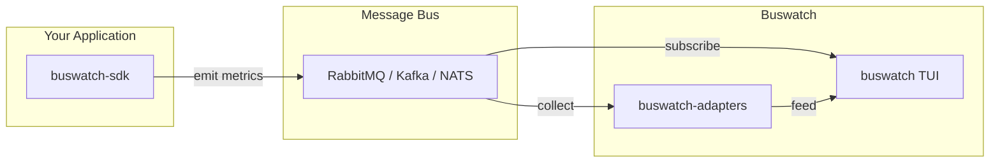

<div align="center">
<pre>
.______    __    __       _______.____    __    ____  ___   .___________.  ______  __    __  
|   _  \  |  |  |  |     /       |\   \  /  \  /   / /   \  |           | /      ||  |  |  | 
|  |_)  | |  |  |  |    |   (----` \   \/    \/   / /  ^  \ `---|  |----`|  ,----'|  |__|  | 
|   _  <  |  |  |  |     \   \      \            / /  /_\  \    |  |     |  |     |   __   | 
|  |_)  | |  `--'  | .----)   |      \    /\    / /  _____  \   |  |     |  `----.|  |  |  | 
|______/   \______/  |_______/        \__/  \__/ /__/     \__\  |__|      \______||__|  |__|
</pre>

<h3>Diagnostic toolkit for message bus observability</h3>


[](https://crates.io/crates/buswatch)
[](https://docs.rs/buswatch)
[](LICENSE)

<hr/>
</div>

## Introduction

Buswatch is a collection of crates for monitoring and diagnosing message bus systems. It provides a terminal UI for real-time visualization, an instrumentation SDK for Rust applications, and adapters for popular message brokers.

Whether you're debugging a slow consumer, tracking message flow through your system, or just want visibility into your message bus, buswatch gives you the tools you need.

## Crates

The repository is organized as a Cargo workspace. Each crate serves a specific purpose and can be used independently or together.

### Core

| Crate | Description |
|-------|-------------|
| [buswatch-types](/buswatch-types) | Core type definitions and JSON schema for the wire format |
| [buswatch-tui](/buswatch-tui) | Terminal UI for real-time monitoring and diagnostics |

### Instrumentation

| Crate | Description |
|-------|-------------|
| [buswatch-sdk](/buswatch-sdk) | Lightweight SDK for instrumenting Rust applications |
| [buswatch-adapters](/buswatch-adapters) | Pre-built collectors for RabbitMQ, Kafka, and NATS |

## Quick Start

### Install the TUI

```bash
cargo install buswatch
```

### Monitor a JSON file

```bash
buswatch -f monitor.json
```

### Connect to a TCP stream

```bash
buswatch --connect localhost:9090
```

### Subscribe to RabbitMQ

```bash
buswatch --subscribe rabbitmq.toml --topic caryatid.monitor.snapshot
```

## Architecture



**Two ways to get data into buswatch:**

1. **Instrumentation (push)**: Add `buswatch-sdk` to your app and emit metrics
2. **Adapters (pull)**: Use `buswatch-adapters` to collect from your message bus

## Wire Format

All components communicate using the [buswatch snapshot format](/buswatch-types/schema/snapshot.schema.json):

```json
{
  "version": { "major": 1, "minor": 0 },
  "timestamp_ms": 1703160000000,
  "modules": {
    "order-processor": {
      "reads": {
        "orders.new": { "count": 1500, "backlog": 23 }
      },
      "writes": {
        "orders.processed": { "count": 1497 }
      }
    }
  }
}
```

See [buswatch-types](/buswatch-types) for the full schema and serialization options.

## Features

- **Real-time TUI** with summary, bottleneck, and flow views
- **Health detection** based on configurable thresholds
- **Sparklines** for visualizing trends
- **Multiple data sources**: files, TCP streams, message bus subscriptions
- **Instrumentation SDK** for Rust applications
- **Adapters** for RabbitMQ, Kafka, and NATS
- **OpenTelemetry** export support
- **JSON and CBOR** serialization

## License

Licensed under the Apache License, Version 2.0. See [LICENSE](LICENSE) for details.
